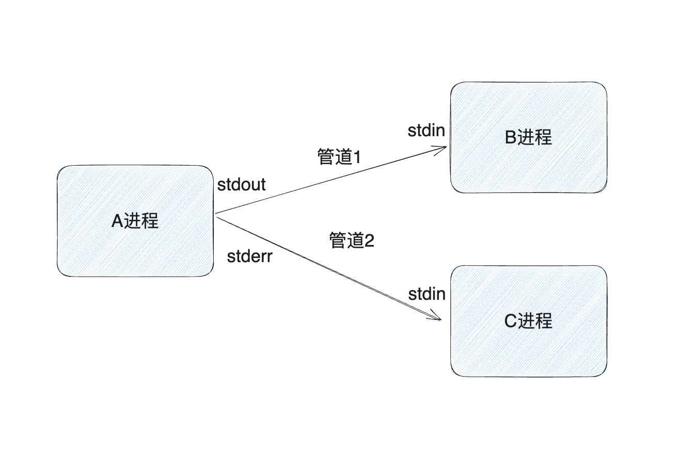

## 进程通信
- pipe
- fifo

## pipe实践
- 当前进程为T，3个子进程ABC
- 两个管道
- A的标准输出重定向到B的标准输入
- A的标准错误重定向到C的标准输入

## 目标
> ps aux | grep yaojun
- 让一个程序把另一个程序的输出作为输入。 

## popen
- popen()函数用于创建一个管道，fork一个子进程，关闭不需要的文件描述符，执行exec函数族，返回文件指针
- pclose()函数用于关闭管道并等待子进程结束
> 注意：popen()函数创建的管道是单向的，如果需要双向通信，需要创建两个管道。 popen()函数创建的管道是阻塞的，如果需要非阻塞的管道，需要使用pipe2()函数。pclose()不会给子进程发任何信号，如果子进程在等待主进程的输入，那么当主进程调用pclose()之后，子进程的stdin会收到EOF，从而使子进程退出。
- popen()不能处理标准错误，只能处理标准输出。

## fgets
- 当 fgets 从标准输入（或其他文件流）读取时，如果成功读取到换行符，它会将换行符包含在返回的字符串中。fgets 读取输入直到遇到换行符、达到指定的最大字符数（包括结尾的空字符）、或到达文件结束符（EOF）为止。换行符是读取结束的标志之一，并会包含在返回的字符串中。

## 文档
[飞书文档](https://ym9omojhd5.feishu.cn/docx/doxcn99jYl3Dx54sjRhfFEsRjZS)

